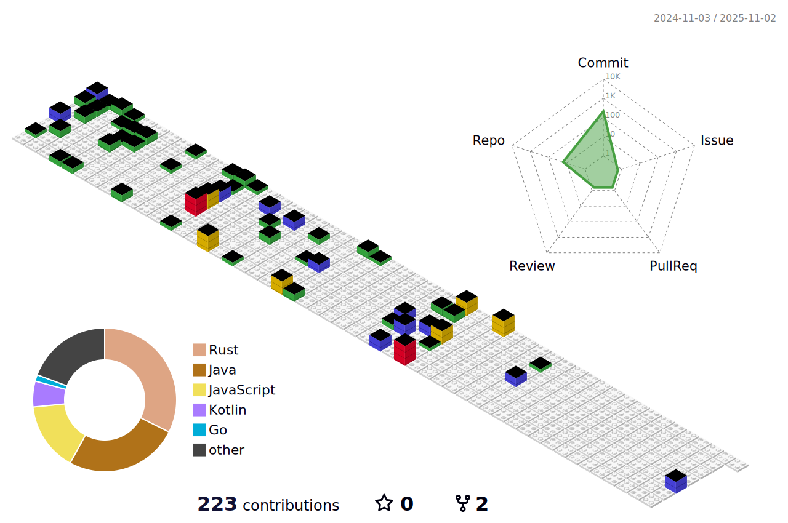

<!--
헤더
-->

	

<!--
기술 스택 아이콘

-->

	<h3>📚 Tech Stack 📚</h3>
	
✨ Platforms & Languages ✨

	
	
	
  	
  	
  	
  	
	 
	
	
	

 

	
🛠 Tools 🛠

	
	
	
	 
	
	
	 
	
	
	 
	
	

 

	
🎨 SNS & Portfolio 🎨

	
	
	
	 

  
   
   

<!--
깃허브 스탯

	
	

  
   
   

-->
		
<!--
3d 잔디
-->

	
	

<!--
**pangorithm/pangorithm** is a ✨ _special_ ✨ repository because its `README.md` (this file) appears on your GitHub profile.

Here are some ideas to get you started:

- 🔭 I’m currently working on ...
- 🌱 I’m currently learning ...
- 👯 I’m looking to collaborate on ...
- 🤔 I’m looking for help with ...
- 💬 Ask me about ...
- 📫 How to reach me: ...
- 😄 Pronouns: ...
- ⚡ Fun fact: ...
-->
